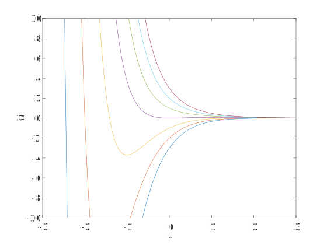
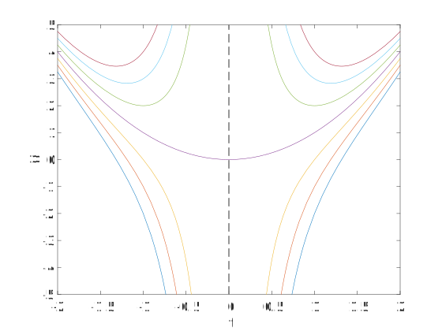

* TOC
{:toc}

*See section 2.2, and section 2.3 excluding Example 4.* 

## Exponential solutions

### FLASH

We start with first-order linear equations, which is about as simple as ODEs can get. That is, we are already guaranteeing F, L, and S in our classification scheme. Let's go even further and go for the all-caps FLASH:

$$
a \frac{dy}{dt} + by = 0,
$$

where $a$ and $b$ are constants. Of course, it's not an ODE if $a=0$, so we rule that out. And then we might as well divide through by $a$ and rename $b/a=k$ to get simply

$$
\frac{dy}{dt} + ky = 0.
$$

This is truly a minimalist ODE! 

You already know the answer to this problem. Once we rewrite it as $y=-ky$, it's clear that the solution must be $y(t)=Ce^{-kt}$ for any choice of the constant $C$. We call this the *general solution*{:.def} of the ODE. It's a slightly misleading term, because it really refers to the infinite *family* of functions $Ce^{-kt}$ for all possible choices of $C$. 

### FLaSH

Our next step up the ladder will be to go from type A to a, to get FLaSH. That is, we let the coefficients become functions of the independent variable $t$:

$$
a(t) \frac{dy}{dt} + b(t)y = 0.
$$

The question of what happens if $a(t)=0$ somewhere is an interesting one, and we will get back to it. For now we will just divide through by $a(t)$ and hope for the best:

$$
\frac{dy}{dt} + p(t)y = 0.
$$

Faced with $y'=-p(t)y$, we see that an exponential function will still solve the problem. Suppose $y=Ce^{-\mu(t)}$. By the Chain Rule, this will be a solution provided that $\mu'=p$. That is, $\mu(t)$ is an antiderivative of $p(t)$: 

$$
\frac{dy}{dt} + p(t)y = 0 \quad \Rightarrow \quad y = C \exp\left[-\int p(t)\,dt\right].
$$

### The integration constant

Recall that the indefinite integral (i.e., antiderivative) allows an arbitrary additive constant. So if $\mu'=p$ as above, then $u(t)=\mu(t)+K$ also satisfies $u'=p$, and therefore

$$
\tilde{y} = C \exp[ -u(t) ]
$$

is also a solution. It follows that

$$
\tilde{y} = C \exp[ -\mu(t) - K ] = ( Ce^{-K}) \exp[-\mu(t)].
$$

This looks superficially different from the solution we defined as $y=Ce^{-\mu(t)}$. But when we consider the family of *all* such solutions for arbitrary constant $C$, we see that $\tilde{y}$ brings us nothing new. So $y$ really is the general solution. The moral of this story is that any antiderivative will do, and we can ignore the integration constant when we find $\mu(t)$.

## FLaSh: Integrating factor

Now let's look at the most general case of a linear, first-order equation (FLaSh),

$$
a(t) \frac{dy}{dt} + b(t)y = c(t).
$$

First we divide through by $a(t)$ to get what the book calls *standard form*{:.def},

$$
\frac{dy}{dt} + p(t)y = q(t).
$$

(The question of what happens if $a(t)$ is zero remains one that we will revisit soon.) The presence of $q(t)$ on the right side is an important new wrinkle. If we try to plug in $y=Ce^{-\mu(t)}$ again, we get results only if $q(t)$ is identically zero.

A modified approach turns out to save the situation. We still use $\exp(\mu(t))$, with $\mu(t)$ to be determined shortly. But instead of proposing it as a solution, we multiply the ODE through by it to get

$$
e^{\mu(t)} \frac{dy}{dt} + p(t)e^{\mu(t)} y = e^{\mu(t)} q(t).
$$

Why was this a good idea? Well, if we again insist that $\mu'=p$, then the chain rule will still be applicable:

$$
e^{\mu(t)} y'(t) + \frac{d}{dt} \left[ e^{\mu(t)} \right] y(t) = e^{\mu(t)} q(t).
$$

And then we interpret the left-hand side as a differentiation product rule, to get

$$
\frac{d}{dt} \left[ e^{\mu(t)} y(t) \right] = e^{\mu(t)} q(t).
$$

The left side can be integrated immediately (which is why $e^\mu$ is called an *integrating factor*{:.def}), leading to the formal solution

$$
y(t) = e^{-\mu(t)} \int e^{\mu(t)} q(t)\, dt, \qquad \mu(t) = \int p(t)\, dt.
$$

This is a bit of a mouthful as a formula. It's better to focus on the process:

1. **Standardize** by dividing through by the coefficient of $y'$. 
1. **Integrate** to find $\mu(t)=\int p(t)\, dt$. Omit this integration constant (for the same reasons we did in the simpler case above).
1. **Exponentiate** to find the integrating factor, $e^{\mu(t)}$.
1. **Multiply** both sides of the ODE from step 1 by the integrating factor.
1. **Rearrange** the left-hand side into the derivative of $e^{\mu(t)} y(t)$. (If this is impossible, you've messed up.)
1. **Integrate** both sides, this time including the integration constant on the right-hand side. 
1. **Multiply** through by $e^{-\mu(t)}$ (or equivalently, divide through by the integrating factor). Solved!


### Example

> Solve $y'+2y = te^{-2t}$.

This is already in standard form.

$$
\begin{aligned}
\mu(t) &= \int 2\, dt = 2t\\
 e^{2t} y' + 2 e^{2t}y &= t \\
[e^{2t}y]' &= t \\
e^{2t}y &= \frac{1}{2}t^2+C\\
y &=  \frac{1}{2}t^2e^{-2t} + Ce^{-2t}
\end{aligned}
$$

Since the solution has an arbitrary constant in it, we call it the general solution. 



```matlab
for C = -3:3
    y = @(t) t.^2.*exp(-2*t)/2 + C*exp(-2*t);
    fplot(y,[-3 3])
    hold on
end
ylim([-10 10])
xlabel t, ylabel y
```

### Example

> Solve $y'+2y = t$.

The left side is the same as the previous example, so the integrating factor is the same. We arrive at

$$ 
\left[ e^{2t} y \right]' = t e^{2t}, 
$$ 

$$ 
e^{2t} y  = \int t e^{2t}\, dt. 
$$ 


{:.meme}

The way to do this integral is by parts ($u=t$, $dv=e^{2t}\,dt$):

$$
\int t e^{2t}\, dt = \int u\, dv = uv - \int v\,du = \frac{1}{2}te^{2t} - \int \frac{1}{2} e^{2t}\, dt = \frac{1}{4}e^{2t}( 2t-1) + C.
$$

Hence $e^{2t}y = \frac{1}{4}e^{2t}( 2t-1) + C$, or

$$
y = Ce^{-2t} + \frac{1}{4}( 2t-1).
$$

The term $Ce^{-2t}$ popped up in the solution of both examples. Do you think that's a coincidence? (Hint: no.) 

### Example

> Solve $ty'+2y = 4t^2$.

A common error is to forget to put the equation into standard form first. Here, that means dividing through by $t$.

$$
\begin{aligned}
\mu(t) &= \int \frac{2}{t}\, dt = 2 \ln t\\
 t^2 y' + 2 ty &= 4t^3 \\
[t^2 y]' &= 4t^3 \\
t^2 y &= t^4+C\\
y &=  t^2 + C t^{-2}
\end{aligned}
$$

An interesting thing about this solution is that it does not exist at $t=0$, unless $C=0$. This is where the coefficient function $2/t$ fails to exist, too. 



```matlab
for C = -3:3
    y = @(t) t.^2 + C./t.^2;
    fplot(y,[-2 2])
    hold on
end
ylim([-5 5])
xlabel t, ylabel y
```
## IVPs

When initial conditions are given, it pins down the value of the arbitrary constant. That is, one of the solution curves is selected--the one that passes through the point specified by the initial condition. 


### Example (*see Example 3 in section 2.3*)

> A pond holds 10 million L of water. Each year, 5 million L flow in and out of the pond (leaving its volume constant). Though the pond [was originally pristine](https://youtu.be/94bdMSCdw20), the inflowing water has become contaminated with benzene, whose concentration varies according to $\gamma(t) = 2 + \sin 2t$ g/L. Find the mass of benzene in the pond as a function of time.

In a "word problem", the first item of business is to find a mathematical model. Here we apply conservation of mass. If $Q(t)$ is the mass of benzene in the pond, then

$$
\frac{dQ}{dt} = \text{mass inflow rate} - \text{mass outflow rate}. 
$$

The inflow rate is calculated as 

$$
\gamma(t) \frac{\text{g}}{\text{L}} \times (5\times 10^6) \frac{\text{L}}{\text{year}}.
$$

The amount flowing out depends on the current concentration:

$$
\frac{Q(t)}{10^7}  \frac{\text{g}}{\text{L}} \times (5\times 10^6) \frac{\text{L}}{\text{year}} = \frac{Q(t)}{2} \frac{\text{g}}{\text{year}}.
$$

Hence

$$
\frac{dQ}{dt} = (5\times 10^6)\gamma(t) - \frac{1}{2}Q.
$$

It's a bit more convenient if we measure mass in megagrams; i.e., let $q=Q/10^6$. Then also $q'=Q'/10^6$, and after the smoke clears,

$$
q' +  \frac{1}{2}q = 5 \gamma(t),
$$

which is in standard form. One more bit of data is that $q(0)=0$, so we have a FLaShI problem. 

We'll be able to solve it, but it's interesting to see the solution computationally first. 

```matlab
dom = [0 20];
N = chebop(@(t,q) diff(q)+q./2-5.*(2+sin(2.*t)), dom);
N.bc = @(t,q) q(0);
q = N\0;
plot(q, 'LineWidth', 2)
xlabel('t'), ylabel('q')
```

Here goes. The integrating factor is $e^{t/2}$, so we get

$$
[e^{t/2}q]' = 5 e^{t/2} \gamma(t) = 10e^{t/2} + 5e^{t/2}\sin(2t).
$$

Integrals like $e^t\sin(t)$ are done using integration by parts. It's a bit tedious, so you might want to resort to [Wolfram Alpha](http://wolframalpha.com) or what have you. Instead of an integration constant, I'm going to use definite integrals as follows:

$$ 
\int_0^t [e^{s/2}q(s)]'\, ds = \int_0^t (10e^{s/2} + 5e^{s/2}\sin(2s))\, ds
$$

$$
e^{t/2} q(t) - q(0) = 20(e^{t/2}-1) + \frac{10}{17}[ e^{t/2} (\sin(2t)-4\cos(2t)) + 4 ].
$$

$$
q(t) = 20 + \frac{10}{17}(\sin(2t)-4\cos(2t)) - \frac{300}{17} e^{-t/2}.
$$
