* TOC
{:toc}

## Fundamental ODE solutions

As we derived before, if $ \mathbf{A} \mathbf{v} = \lambda \mathbf{v}$, then one solution of $ \mathbf{x}'= \mathbf{A} \mathbf{x}$ is $ \mathbf{x}(t) = e^{\lambda t} \mathbf{v}$. If the eigenvalues of $ \mathbf{A} $ are distinct, or if there are nondefective repeats, then these provide a fundamental set of solutions. (If an eigenvalue is repeated and defective, more analysis needs to be done. To be continued.)

### Example

*(See Example 6 of section 3.3.)*

> Find the general solution of
> $$\mathbf{x}' = \begin{bmatrix} -1 & 4 \\ 1/2 & -2 \end{bmatrix} \mathbf{x}.$$

We'll use MATLAB to find the eigenvalue decomposition.

~~~matlab
>> [V,D] = eig([-1 4;1/2 -2])

V =

    0.9701   -0.8944
    0.2425    0.4472

D =

     0     0
     0    -3

>> V(:,1)/V(2,1)

ans =

     4
     1

>> V(:,2)/V(2,2)

ans =

    -2
     1
~~~

Thus the general solution is

$$c_1 \begin{bmatrix} 4\\1 \end{bmatrix} + c_2 e^{-3t} \begin{bmatrix} -2 \\ 1 \end{bmatrix}.$$

### Example

> Solve
> $$\mathbf{x}' = \begin{bmatrix} 1 & -1 \\ 5 & -3 \end{bmatrix} \mathbf{x},\quad \mathbf{x}(0) = \begin{bmatrix} 1 \\ -2 \end{bmatrix}.$$

We use MATLAB for the eigenvalue stuff.

~~~matlab
[V,D] = eig([1 -1;5 -3])
V(:,1)/V(1,1)
~~~

From here, we could write down the general solution as

$$ c_1 e^{(-1+i)t} \begin{bmatrix} 1 \\ 2-i \end{bmatrix} + \bar{c}_1 e^{(-1-i)t} \begin{bmatrix} 1 \\ 2+i \end{bmatrix}.$$

But we probably prefer a purely real form. To get it, we use the Re and Im parts of 

$$ e^{-t} \left[  e^{it} \left( \begin{bmatrix} 1 \\ 2 \end{bmatrix} + \begin{bmatrix} 0 \\ -i \end{bmatrix} \right) \right],$$

giving

$$ \mathbf{x}_1(t) = e^{-t}\left( \cos(t) \begin{bmatrix} 1 \\ 2 \end{bmatrix} + \sin(t) \begin{bmatrix} 0 \\ 1 \end{bmatrix} \right)$$ 

and

$$ \mathbf{x}_2(t) = e^{-t}\left( \cos(t) \begin{bmatrix} 0 \\ -1 \end{bmatrix} + \sin(t) \begin{bmatrix} 1 \\ 2 \end{bmatrix} \right).$$

So a fundamental matrix is

$$ \mathbf{X}(t) = e^{-t} \begin{bmatrix} \cos(t) & \sin(t) \\ 2\cos(t)+\sin(t) & 2\sin(t)-\cos(t) \end{bmatrix}$$

and the general solution is $ \mathbf{X}(t) \mathbf{c}$.

Applying the initial condition, we have 

$$ \begin{bmatrix} 1 \\ -2 \end{bmatrix} = \mathbf{X}(0) \mathbf{c} = \begin{bmatrix} 1 & 0 \\ 2 & -1 \end{bmatrix} \mathbf{c}.$$

Thus

$$ \mathbf{c} = \begin{bmatrix} 1 & 0 \\ 2 & -1 \end{bmatrix}^{-1} \begin{bmatrix} 1 \\ -2 \end{bmatrix}
= \begin{bmatrix} 1 & 0 \\ 2 & -1 \end{bmatrix} \begin{bmatrix} 1 \\ -2 \end{bmatrix} = \begin{bmatrix} 1 \\ 4 \end{bmatrix}.$$

The solution is

$$ \mathbf{x}(t) =  e^{-t} \begin{bmatrix} \cos(t) & \sin(t) \\ 2\cos(t)+\sin(t) & 2\sin(t)-\cos(t) \end{bmatrix} \begin{bmatrix} 1 \\ 4 \end{bmatrix}.$$

## Phase plane

The eigenvalues and eigenvectors dictate how the phase plane looks. The general solution is

$$c_1 e^{\lambda_1 t} \mathbf{v}_1 + c_2 e^{\lambda_2 t} \mathbf{v}_2.$$

### Real eigenvalues

The sign of $\lambda_k$ forces growth or decay in the direction of $\mathbf{v}_k$ as $t\to\infty$. 

Now say also that $\lambda_1>\lambda_2$. As $t\to\infty$, the relative contribution from $e^{\lambda_2 t}$ is insignificant, and the solution lies nearly on the line through the origin in the direction of $\mathbf{v}_1$. 

**Nodal sink / stable node**

If $\lambda_{1,2}<0$, all solutions eventually decay into the origin.

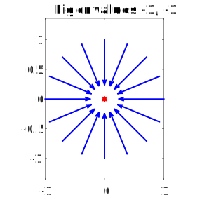

If $\lambda_2<\lambda_1<0$, then eventually the direction $\mathbf{v}_1$ dominates (unless its coefficient is zero).

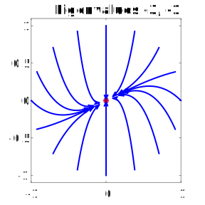 

**Nodal source / unstable node**

If $\lambda_{1,2}>0$, all solutions eventually move away from the origin.

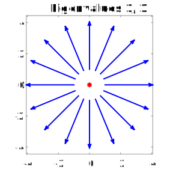

If $\lambda_2<\lambda_1<0$, then eventually the direction $\mathbf{v}_1$ dominates (unless its coefficient is zero).

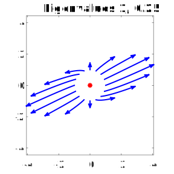

**Saddle**

If the eigenvalues have opposite signs, the origin is unstable, but solutions are attracted in one direction and pushed away in the other.

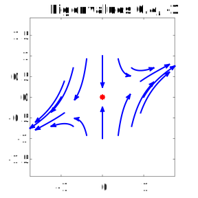

**Zero eigenvalue**

If one eigenvalue is zero, there is a line of equilibria along that direction. Their stability is determined by the other eigenvalue.

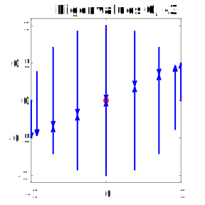
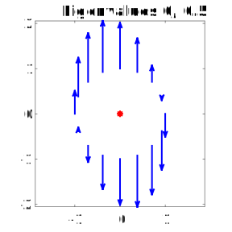

### Complex eigenvalues

When the eigenvalues and eigenvectors are complex, there are no fixed real directions to be attracted to or repelled from. Instead, we get rotational/spiral behavior.

**Spiral sink / stable spiral**

When the real parts are both negative, solutions spiral inward.

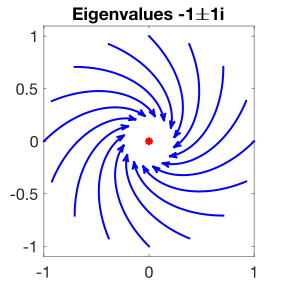
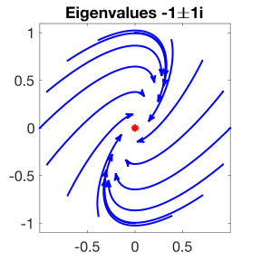

**Spiral source / unstable spiral**

When the real parts are both positive, solutions spiral outward.

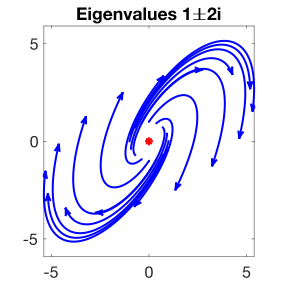

**Center**

When the real parts are zero, we get "neutral stability." You see this a lot when energy is being conserved.

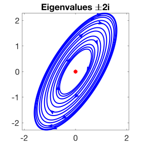
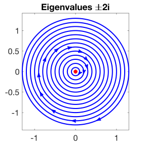

