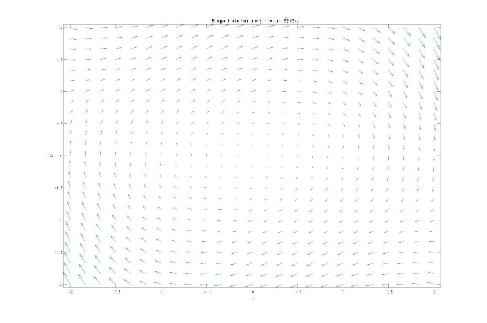
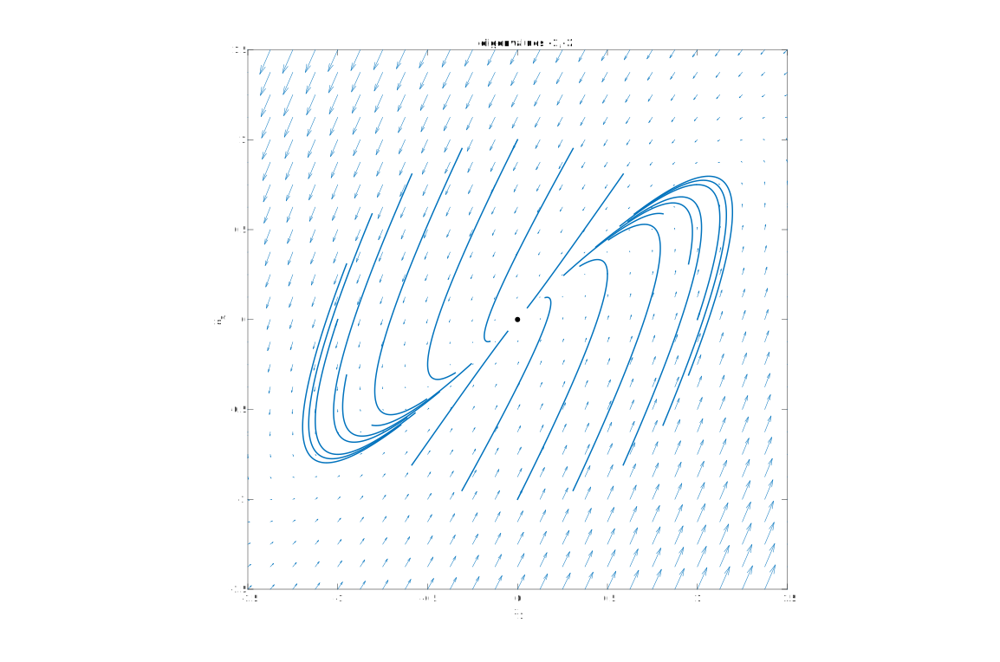
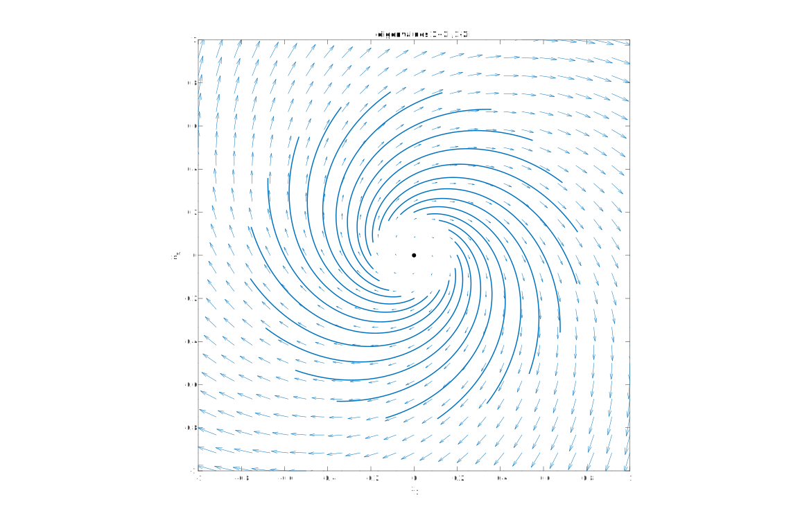

* TOC
{:toc}

Systems of the form $\mathbf{x}'=\mathbf{f}(\mathbf{x})$ for 2-dimensional $\mathbf{x}$ are often discussed in terms of the *phase plane*{:.def}, which is the $(x_1,x_2)$-plane. This is partly because 2D visualization is very useful, partly because 2D systems have certain properties not seen in 1D but simpler than dimensions 3 and higher, and partly because of physical significance--in an application of Newton's law, for example, $x_1$ will be position and $x_2$ will be velocity (or momentum).

## Direction fields

Similar to what we did for $y'=f(t,y)$ in the $(t,y)$-plane, we can make a *direction field* or slope field for a 2D autonomous system. At each point $(x_1,x_2)$ we have a vector $[F-1,f_2]$ that gives the instantaneous velocity of a solution passing through that point. By plotting this vector field (2D function of 2 variables) we get an idea of how solutions look.

> Make a direction field for the *van der Pol equation*, $y''+\mu(y^2-1)y'+y=0$, where $\mu>0$. 

First we need to convert to a first-order system in 2 variables:

$\begin{align} x_1' &= x_2, \\\\ x_2' &= x_1 - \mu(x_1^2-1)x_2.\end{align}$

Then we can feed this into code I wrote for making these direction fields. (I use $x$ and $y$ as the two variables in the code.) 

```matlab
slopefieldxy(@(x,y) y,@(x,y) -x+.5*(1-x.^2).*y,[-2 2],[-2 2])
```
 


## Phase portraits

When the system is 2D, linear, and homogeneous, $\mathbf{x}'=\mathbf{A}\mathbf{x}$, with constant matrix $\mathbf{A}$, there is a fairly small number of unique patterns in the solutions due to the eigenvalues of the matrix. By drawing many sample trajectories near the fixed point of the origin on a single graph, we get a *phase portrait*{:.def} that summarizes the behaviors pretty well.

For example, a nodal sink:

```matlab
A = [ 1 -2; 3 -4 ];

clf

slopefieldxy(@(x,y) A(1,1)*x+A(1,2)*y,@(x,y) A(2,1)*x+A(2,2)*y,[-1.5 1.5],[-1.5 1.5])

lam = eig(A);
tmax = 3/max(abs(lam));
numtheta = 20;  R =1;
hold on
plot(0,0,'k.','markersize',18)
    
% Plot trajectories
hold on
colr = get(gca,'colororder');
t = linspace(0,tmax,300);
x = zeros(2,length(t));
for theta = 2*pi*(0:numtheta-1)/numtheta
    x0 = R*[ cos(theta); sin(theta) ];
    for j = 1:length(t)
        x(:,j) = expm(A*t(j))*x0;
    end
    plot(x(1,:),x(2,:),'linew',1.5,'color',colr(1,:))
end

% Pretty up
axis([-1.5 1.5 -1.5 1.5]), axis square
title(['eigenvalues ',num2str(lam(1)),',',num2str(lam(2))])
xlabel('x_1')
ylabel('x_2')
```

 

And here's a spiral source:

```matlab
A = [ 1 2; -2 1 ];

clf

slopefieldxy(@(x,y) A(1,1)*x+A(1,2)*y,@(x,y) A(2,1)*x+A(2,2)*y,[-1 1],[-1 1])

lam = eig(A);
tmax = 3/max(abs(lam));
numtheta = 20;  R =.2;
hold on
plot(0,0,'k.','markersize',18)
    
% Plot trajectories
hold on
colr = get(gca,'colororder');
t = linspace(0,tmax,300);
x = zeros(2,length(t));
for theta = 2*pi*(0:numtheta-1)/numtheta
    x0 = R*[ cos(theta); sin(theta) ];
    for j = 1:length(t)
        x(:,j) = expm(A*t(j))*x0;
    end
    plot(x(1,:),x(2,:),'linew',1.5,'color',colr(1,:))
end

% Pretty up
axis([-1 1 -1 1]), axis square
title(['eigenvalues ',num2str(lam(1)),',',num2str(lam(2))])
xlabel('x_1')
ylabel('x_2')
```

 
