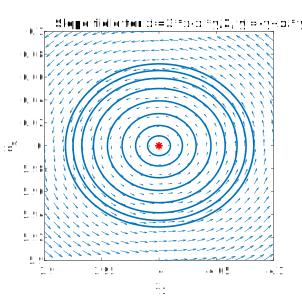
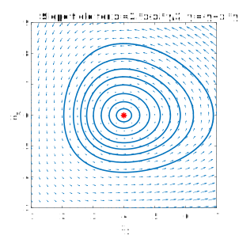
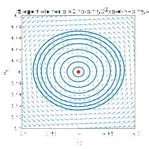
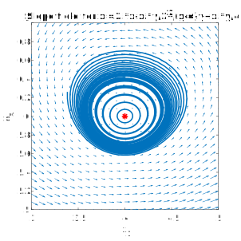

* TOC
{:toc}

*(See section 7.2.)*

Here comes one of the most important moments in the course: **when faced with a nonlinear problem, our first response is to try to linearize it**.

Suppose $\mathbf{x}' = \mathbf{f}(\mathbf{x})$ has a fixed point $ \mathbf{z}$. For concreteness we start with two dimensions. Then if we look at points close by to $ \mathbf{z}$, we have

$$\begin{align}
f_1(z_1+s_1,z_2+s_2) &= f_1(z_1,z_2) + s_1 \frac{\partial f_1}{\partial x_1}(z_1,z_2) + s_2 \frac{\partial f_1}{\partial x_2}(z_1,z_2 ) + HOT, \\
f_2(z_1+s_1,z_2+s_2)  &= f_2(z_1,z_2) + s_1 \frac{\partial f_2}{\partial x_1}(z_1,z_2) + s_2 \frac{\partial f_2}{\partial x_2}(z_1,z_2 ) + HOT.
\end{align}$$

Here "HOT" stands for "higher-order terms," meaning products of $s_1$ and $s_2$. If we keep $s_1$ and $s_2$ small, then these terms may be ignored. Because $\mathbf{z}$ is a fixed point, $f_1=f_2=0$ there, so 

$$\begin{align}
\begin{bmatrix} f_1(z_1+s_1,z_2+s_2)  \\ f_2(z_1+s_1,z_2+s_2) \end{bmatrix} \approx
\begin{bmatrix} \frac{\partial f_1}{\partial x_1} & \frac{\partial f_1}{\partial x_2} \\ \frac{\partial f_2}{\partial x_1} & \frac{\partial f_2}{\partial x_2} \end{bmatrix}
\begin{bmatrix} s_1 \\ s_2 \end{bmatrix}.
\end{align}$$

The matrix above is called a *Jacobian matrix*{:.def}. We've lightened the notation for simplicity, but remember that the entries of this matrix should be evaluated at the fixed point. (Like any derivative, the Jacobian matrix is a function of the independent variable $\mathbf{x}$, but we can evaluate it at one point to get a constant matrix.) In the general case of $n$ dimensions, the $(i,j)$ entry of the Jacobian matrix is

$$\frac{\partial f_i}{\partial x_j}.$$

Continuing with the ODE system, let's define $u_1(t)=x(t)-z_1$, $u_2(t)=y(t)-z_2$. Clearly $u_i'=x_i'$, and

$$\begin{align}
\begin{bmatrix} u_1'(t)   \\ u_2'(t) \end{bmatrix} =
\begin{bmatrix} f_1(z_1+u_1,z_2+u_2)  \\ f_2(z_1+u_1,z_2+u_2) \end{bmatrix} \approx 
\begin{bmatrix} \frac{\partial f_1}{\partial x_1} & \frac{\partial f_1}{\partial x_2} \\ \frac{\partial f_2}{\partial x_1} & \frac{\partial f_2}{\partial x_2} \end{bmatrix}
\begin{bmatrix} u_1 \\ u_2 \end{bmatrix} = \mathbf{J} \mathbf{u}.
\end{align}$$

We have arrived at a homogeneous linear system, $\mathbf{u}'=\mathbf{J}\mathbf{u}$, that governs perturbations to the fixed point. So long as we are "close enough" to the fixed point, the eigenvalues and eigenvectors of $\mathbf{J}$ reveal what is essentially going on.

(The precise meaning of "close enough" is pretty technical and usually difficult or impossible to calculate in practice.)

### Example

> Find and characterize the fixed points of 
> $$ \begin{align}  x_1' &= (4+x_1)(x_2-x_1), \\ x_2' &= (10-x_1)(x_1+x_2). \end{align}$$

From the first component we get $x_1=-4$ or $x_1=x_2$. Plugging into the second component, we get $(-4,4)$, $(10,10)$, and $(0,0)$ as the only possibilities. Now

$$ \mathbf{J} = \begin{bmatrix} x_2 -2x_1 -4 & 4+x_1 \\ -2x_1 -x_2 + 10 & 10-x_1 \end{bmatrix}.$$

* At $(0,0)$: 

$$ \mathbf{J} = \begin{bmatrix}  -4 & 4\\ 10 & 10 \end{bmatrix}.$$ 

The eigenvalues are $-6.4340$ and $12.4340$, so this is a saddle. 

* At $(10,10)$: 

$$ \mathbf{J} = \begin{bmatrix}  -14 & 14\\ -20 & 0 \end{bmatrix}.$$ 

The eigenvalues are $-7 \pm 15.1987i$, so this is a spiral sink.

* At $(-4,4)$: 

$$ \mathbf{J} = \begin{bmatrix}  8 & 0 \\ 14 & 14 \end{bmatrix}.$$ 

The eigenvalues are 8 and 14, so this is a nodal source.

~~~matlab
f = @(x,y) (4+x).*(y-x);
g = @(x,y) (10-x).*(y+x);

figure
slopefieldxy(f,g,[-7 13],[-2 12])
hold on
plot([0 10 -4],[0 10 4],'r*')
axis equal

figure
slopefieldxy(f,g,0+[-.2 .2],0+[-.2 .2])
hold on
plot(0,0,'r*')
axis equal

figure
slopefieldxy(f,g,10+[-.1 .1],10+[-.1 .1])
hold on
plot(10,10,'r*')
axis equal

figure
slopefieldxy(f,g,-4+[-.1 .1],4+[-.1 .1])
hold on
plot(-4,4,'r*')
axis equal

%%
figure
slopefieldxy(f,g,[-10 20],[-5 25])
hold on
plot([0 10 -4],[0 10 4],'r*')
axis equal

N = chebop(@(t,x,y) [diff(x)-f(x,y); diff(y)-g(x,y)],[0 0.5],[],[]);
[X,Y] = ndgrid(-5:4:15,-5:4:15);
for i = 1:numel(X)
    N.lbc = [ X(i); Y(i) ] + 0.5*randn(2,1);
    [x,y] = N\0; 
    arrowplot(x,y,'color','b')
    axis([-10 16 -4 20]), drawnow
end
~~~

### Example

> Earlier we saw the van der Pol equation, $y''+\mu(y^2-1)y'+y=0$ (constant $\mu>0$). Find its fixed points, and linearize about each one. Classify the type of each fixed point.

The ODE is equivalent to the system

$$\begin{align} x_1' &= x_2 = f_1(x_1,x_2), \\\\ x_2' &= -x_1 - \mu(x_1^2-1)x_2 = f_2(x_1,x_2).\end{align}.$$

Note that $f_1=0$ implies that $x_2=0$. Then $f_2=0$ as well implies that $x_1=0$. So the origin is the only fixed point.

The Jacobian matrix at any $(x_1,x_2)$ is

$$\begin{bmatrix} 0 & 1 \\\\ -1-2\mu x_1x_2 & \mu(1-x_1^2) \end{bmatrix}.$$ 

At the origin, this is

$$\begin{bmatrix} 0 & 1 \\\\ -1 & \mu \end{bmatrix}.$$ 

The characteristic polynomial is $\lambda^2-\mu\lambda + 1$, which has roots $\frac{1}{2}(\mu \pm\sqrt{\mu^2-4})$. There are three distinct cases:

1. If $0<\mu<2$, then the eigenvalues are imaginary with positive real part. This gives a spiral source.
1. If $\mu=2$, the matrix is defective with eigenvalue 1. This is a nodal source.
1. If $\mu>2$, then one eigenvalue is negative and the other is positive. This is a saddle.

In all cases, the origin is unstable. 

---

## Centers

For all linearized fixed point types except one, the stability of the fixed point in the nonlinear system is the same as in the linearized system. The exception is when the linearized case is a center (pure imaginary eigenvalues). Informally, the stability in this case is right on the borderline, and can be tipped either way depending on the details of what's in the nonlinear terms.

### Example

> Investigate
> $$ \begin{align}  \frac{dx}{dt} &= 3x-\frac{xy}{2}, \\ \frac{dy}{dt} &= -y+\frac{xy}{4}, \end{align}$$
> near the fixed point $(4,6)$.

We compute (using letter subscripts for partial derivative notation) the Jacobian matrix,

$$ \mathbf{J}(x,y) = \begin{bmatrix} f_x & f_y  \\ g_x & g_y \end{bmatrix} = \begin{bmatrix} 3-y/2 & -x/2 \\ y/4 & -1+x/4 \end{bmatrix}.$$ 

We evaluate it at the fixed point to get a constant matrix,

$$ \mathbf{J}(4,6) =  \begin{bmatrix} 0 & -2 \\ 3/2 & 0 \end{bmatrix}.$$

The eigenvalues are readily found to be $\pm i\sqrt{3}$, which makes the linearized fixed point a center.

If we stay close to the fixed point, the system response looks very much like that of the linearization.

~~~matlab
% Plot the direction field around the FP at (4,6).

clf

f = @(x,y) 3.*x-x.*y/2;
g = @(x,y) -y + x.*y/4;

window = [-0.2 0.2];

slopefieldxy(f,g,4+window,6+window)
hold on
plot(4,6,'r*')

% Plot some solutions of the full nonlinear system.
R = window(2)*(1:8)/9;
theta = pi*(0:7)/8;
tmax = 4;
numtheta = 10;

colr = get(gca,'colororder');
t = linspace(0,tmax,300);
x = zeros(2,length(t));
odefun = @(t,x) [f(x(1),x(2));g(x(1),x(2))];
for i = 1:length(R)
    x0 = [4;6] + R(i)*[ cos(theta(i)); sin(theta(i)) ];
    [t,x] = ode45(odefun,t,x0);
    plot(x(:,1),x(:,2),'linew',1.5,'color',colr(1,:))
end

% Pretty up
axis([4+window, 6+window]), axis square
xlabel('x_1')
ylabel('x_2')
~~~

However, if we zoom out, the orbits change shape a lot.

 

But note that a term like $(x-4)^2$ can be added to either ODE above without changing the Jacobian at the fixed point. Suppose we add it to the first ODE. Near the fixed point, nothing seems to have changed much.

 

Yet when we zoom out again (or just let time go longer), we find that the trajectories no longer close up. Instead they start to get pushed back into the fixed point.

 
